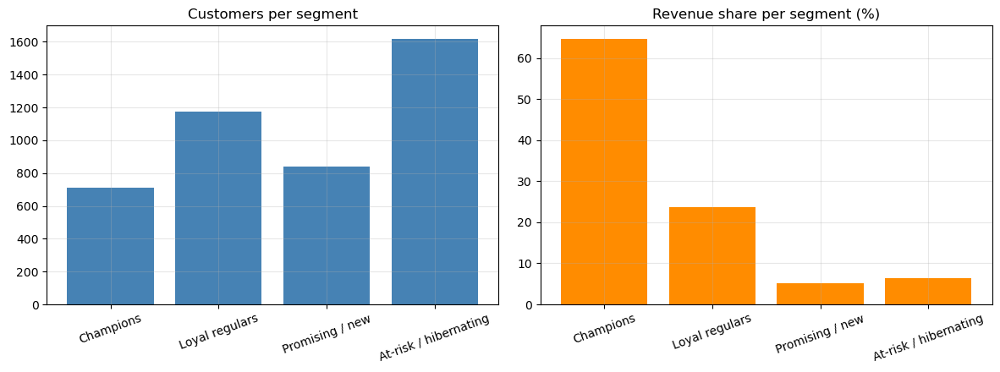
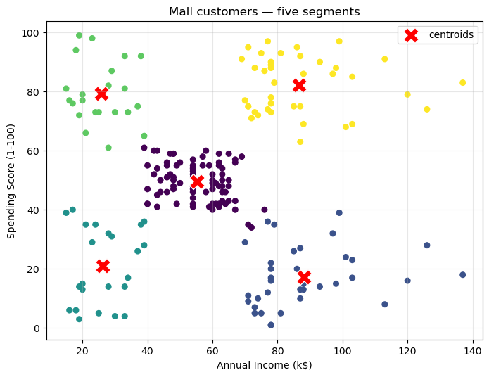
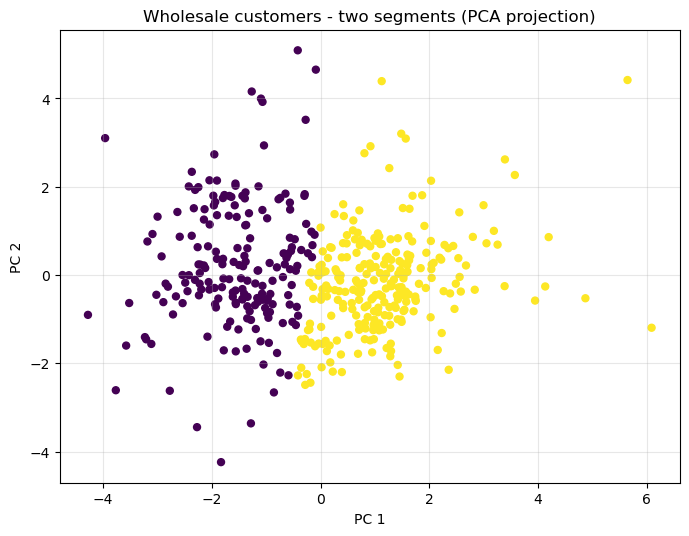

# Customer Segmentation with K-Means

**From a from-scratch NumPy implementation to CRM-ready customer segments — proven on three real datasets.**

This project is the practical companion to my presentation *An Introduction to K-Means*
([`presentation/Presentation_beta3.pptx`](presentation/Presentation_beta3.pptx)). The presentation
makes the claims; the [master notebook](notebooks/Customer_Segmentation_Master.ipynb) proves them
on real customer data of increasing difficulty.



## What's inside

| Chapter | Dataset | Size | What it proves |
|---|---|---|---|
| 1 | Synthetic blobs | 500 points | My [from-scratch K-means](src/kmeans.py) matches scikit-learn (adjusted Rand = **1.0**) |
| 2 | Mall Customers | 200 customers | Choosing K honestly: elbow **and** silhouette agree on K = 5 |
| 3 | Wholesale Customers (UCI) | 440 clients | Unscaled data reduces K-means to single-feature binning; after log + scaling the segments recover the true sales channel the model never saw |
| 4 | Online Retail (UCI) | 541,909 transactions | RFM feature engineering turns raw transaction logs into four named segments — the top one is 16 % of customers carrying **65 % of revenue** |

## Key results

<p>
  
  
</p>

* **Correctness** — my 40-line NumPy K-means ([`src/kmeans.py`](src/kmeans.py)) reproduces
  scikit-learn's partition exactly on a controlled problem.
* **Method** — K is never guessed: elbow + silhouette vote on every dataset, and business
  judgement breaks ties (documented in the notebook, not hidden).
* **Validation** — on the wholesale data, the unsupervised segments align with the held-out
  horeca/retail channel (adjusted Rand 0.51, 86 % agreement) — evidence the segments are real,
  not just a converged optimizer.
* **Business value** — every segment gets a name and an action (loyalty tier, cross-sell,
  onboarding, selective win-back), summarised in a CRM playbook table.

## Repository layout

```
├── notebooks/
│   └── Customer_Segmentation_Master.ipynb   # the master notebook (executed, read it on GitHub)
├── src/
│   └── kmeans.py                            # K-means from scratch, sklearn-compatible API
├── data/
│   ├── get_data.py                          # re-downloads every dataset from source
│   ├── Mall_Customers.csv
│   ├── wholesale_customers.csv
│   └── online_retail.csv.gz                 # UCI Online Retail, converted from xlsx
├── presentation/
│   └── Presentation_beta3.pptx              # "An Introduction to K-Means"
├── reports/figures/                         # all figures exported by the notebook
└── requirements.txt
```

## Reproduce it

```bash
git clone <this-repo>
cd KmeanSegmentation
pip install -r requirements.txt
python data/get_data.py        # only needed if the data/ files are missing
jupyter notebook notebooks/Customer_Segmentation_Master.ipynb
```

The notebook runs top-to-bottom in a few minutes; every figure in `reports/figures/` is
regenerated by it.

## Data sources

* **Mall Customers** — the classic 200-customer mall dataset (Machine Learning A-Z course mirror).
* **Wholesale Customers** — [UCI ML Repository](https://archive.ics.uci.edu/ml/datasets/wholesale+customers):
  annual spend of 440 wholesale clients of a Portuguese distributor.
* **Online Retail** — [UCI ML Repository](https://archive.ics.uci.edu/ml/datasets/online+retail):
  all transactions of a UK online gift retailer, Dec 2010 – Dec 2011.

## Author

**Horia-Iulian State** — B.Sc. Data Science (IU International University of Applied Sciences).
This project grew out of my *Introduction to Data Science* presentation on K-means and my
clustering coursework (K-means vs. agglomerative vs. DBSCAN, compared with the adjusted Rand score).
